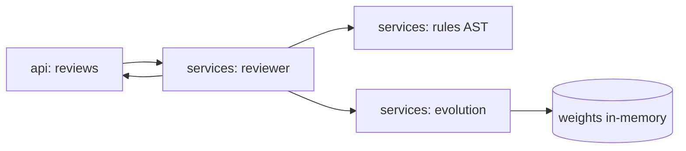

# agent-code-review

[](https://github.com/Shamanchi/agent-code-review/actions/workflows/ci.yml)
[](https://www.python.org/)
[](./Dockerfile)
[](./LICENSE)

> **English TL;DR:** FastAPI agent that reviews Python code with deterministic AST rules and self-evolves: accept/reject feedback reweights rules, so repeated noise sinks and useful findings rise. Fully offline — no tokens needed.

Агент ревью Python-кода: разбирает код через AST, находит типовые проблемы (длинные функции, `bare except`, `print`, `TODO`, `wildcard import`, функции без docstring) и самообучается — фидбек accept/reject меняет веса правил, и сортировка находок подстраивается под команду. Работает полностью офлайн.

Источник темы: `Hands-On-AI-Engineering / P-140 (self_evolving_code_review_agent)` — идею и постановку взяли из каталога, код и тексты написаны с нуля.

## Какую задачу решает

Команде нужен быстрый пред-ревью контроль качества без внешних сервисов: разработчик шлёт код, получает список находок с severity и подсказками, отмечает полезные/шумные — агент запоминает фидбек и в следующих ревью сортирует и приглушает шумные правила.

## Архитектура



Слои: `api/` → `services/` → `core/`, настройки через `pydantic-settings`.

## Быстрый старт

```bash
cp .env.example .env
pip install -r requirements.txt
uvicorn app.main:app --reload
curl -X POST http://127.0.0.1:8000/api/v1/reviews -H "Content-Type: application/json" -d "{\"code\": \"def f():\n    print(1)\n\"}"
```

Docker:

```bash
docker compose up --build
```

## API

- `GET /api/v1/health` — проверка сервиса.
- `POST /api/v1/reviews` — ревью кода. Тело: `{"code": "...", "language": "python"}`. Ответ: `findings` (rule, severity, line, message, suggestion, weight), отсортированы по `weight × severity`.
- `POST /api/v1/feedback` — фидбек: `{"rule": "print-call", "accepted": true}`. Меняет вес правила.
- `GET /api/v1/rules` — текущие веса правил.

Пример ответа `reviews` (сокращённо):

```json
{
  "findings": [
    {"rule": "bare-except", "severity": 3, "line": 4, "message": "Bare except...", "suggestion": "Catch specific exceptions", "weight": 1.0}
  ],
  "summary": {"total": 2, "by_severity": {"3": 1, "1": 1}}
}
```

## Переменные окружения (.env)

| Переменная | Назначение | По умолчанию |
|---|---|---|
| `MAX_FUNCTION_LINES` | Порог длины функции для правила | `50` |
| `MIN_WEIGHT` / `MAX_WEIGHT` | Границы самообучения весов | `0.1` / `2.0` |
| `UPVOTE_STEP` / `DOWNVOTE_STEP` | Шаги accept/reject | `0.1` / `0.2` |
| `APP_HOST` / `APP_PORT` | Хост/порт API | `0.0.0.0` / `8000` |

Полный список — в [.env.example](./.env.example).

## Тесты

```bash
pip install -r requirements.txt
pytest -q
pytest -q -m integration
```

Unit-тесты без сети. Интеграционные (`-m integration`) — через TestClient, тоже без сети.

## Контакты

- Telegram: @PavelYrevichh
- Email: Lietman46@mail.ru
- GitHub: Shamanchi
- FL.ru: https://www.fl.ru/users/Shamanchi
